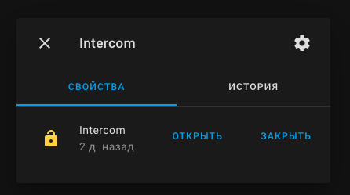
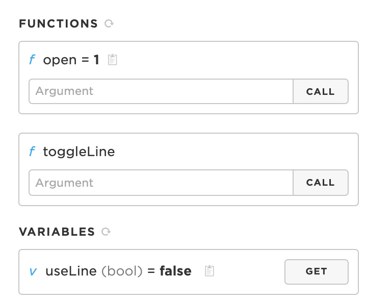

# Intercom

Intercom assistant, built for integrate your old-school intercom with Particle Cloud and Home Assistant

## Flow


### Without line voltage change

1. trigger intercom call (call your apartment)
2. trigger particle function or use home assistant
3. Line Hangup
4. Button Press
5. Button Release
6. Line Hangdown

### With line voltage change

1. trigger intercom call (call your apartment)
2. line voltage change (no user interaction needed)
3. Line Hangup
4. Button Press
5. Button Release
6. Line Hangdown

## Setup

1. [Connect and setup your device with particle cloud](https://setup.particle.io/)
2. Change MQTT Server IP at `mqtt_server`
3. add Home Assistant config to `configuration.yaml`

```yaml
lock:
  - platform: mqtt
    name: Intercom
    state_topic: "homeassistant/intercom/state"
    command_topic: "homeassistant/intercom/set"
```

4. [Flash your device](https://docs.particle.io/tutorials/developer-tools/workbench/#cloud-build-and-flash)

## Usage

### Home Assistant

Your entity id will be `lock.intercom`



### [Particle Cloud Console](https://console.particle.io/devices)

Use functions inside your device view



### [Particle Cloud REST function call](https://docs.particle.io/reference/api/)

#### Example Request

Replace `<device_id>` with your id.
Replace with `<access_token>` with your token.

```console
$ curl https://api.particle.io/v1/devices/<device_id>/open \
       -d arg="" \
       -d access_token=<access_token>
```

### Siri or Shortcuts

[You can get shortcut here](https://www.icloud.com/shortcuts/ebc8767c61c3402483421795c2679d4e)
